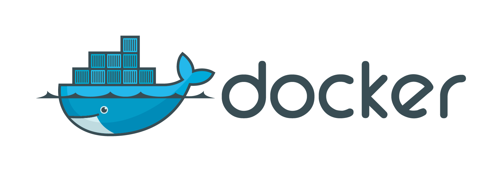

# Docker. Основные команды

Просмотретить локальные имиджи:
```
sudo docker images
```


Запустиить контейнер docker в интерактивном режиме (выход -- exit):
```
sudo docker run -it ubuntu /bin/bash
```

Посмотреть список контейнеров + посмотреть имя:
```
sudo docker ps -a 
```

Запустить контейнер в бэкграунде:
```
sudo docker start <name>
```

Создать контейнер с определенным именем и хостнеймом:
```
sudo docker run --name ep4sh --hostname ebash -it ubuntu bash
```

Просмотреть изменения в контейнере:
```
sudo docker diff ep4sh
sudo docker logs ep4sh
```
Удалить контейнер:
```
sudo docker rm (<id> | <name>)
```

Запуск в режиме демона nginx: 
```
docker run -d \
    -v your_local_config_file.conf:/etc/nginx/nginx.conf \
    -p 80:80 \
    --name nginx \
    blacklabelops/nginx
```

