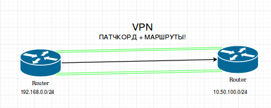

# Mikrotik. MTCNA. VPNz



### VPN -- виртуальный патчкорд+маршруты

**Stateless** (если падает инет - интерфес все равно будет в **UP; нужны белые ip**):
1. GRE
2. IP-IP (меньше заголовков)
3. EoIP (broadcast, M проприетарный)

**StateFull** - падает инет, уходит в **DOWN**:
1. pptp (gre, tcp 1723) (mppe)
2. l2tp (udp) (ipsec)
3. sstp (tcp 443) (ssl)
4. ovpn (tcp, любой) (ssl)
5. PPPoE (L2)

```
Local Address \
| === вспомогательные ip-адреса главное чтоб были, чаще /32
Remote Address /
```

**Profile** - настройка юзеров, можно создавать простые очереди  
Поле **bridge** - протокол **BCP** - бридж контрол протокол, создан для бриджевания **PPTP, L2Tp**
