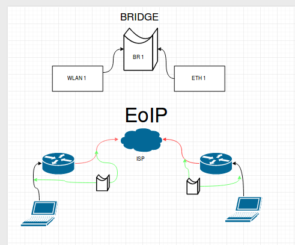

# Mikrotik. MTCNA. Бриджинг. Свитчинг. DNS

**Бриджинг** - софтварный свитчинг, можно добавть интерфейсы, которые имеюются в соответсвующей вкладке.  

**Свитчинг** - хардварный брилджинг



Супер крутая штука - **EoIP** (**М** проприетарный протокол) через интернеты (эти ваши).

Способы создания **VLAN**:
1. Bridge
2. by HANDS (switch-chip)

Перенос в свич-чип:
  * Port -> Genereal -> Hardware offload
  * Мастер-порта больше нет!

**DNS**

```
Ip->DNS
Allow Remote Request ( если галка стоит, M - становится сервером)
```  

Скачать схему для Draw.io:  
``` https://github.com/ep4sh/Draw.io/blob/master/Mikrotik-brigde.xml ```
