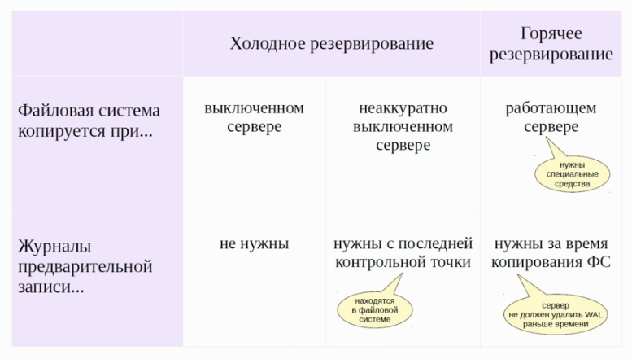

# Резервное копирование

## Логическое резервирование
+ сделать копию любого объекта
+ восстановление на кластере другой версии / архитектуры / ОС
- невысокая скорость

### COPY
Резервное копирование в файл, stdout, канал
Восстановление строк из файла, stdin

КОпия таблицы с помощью `psql`:
```
\COPY
```

### Копия БД `pg_dump`:

#### Резервное копирование:
* вывод stdout / файл / архив с специальным оглавлением
* поддерживает параллельное выполнение
* позволяет ограничит набор выгружаемых объектов (DML / DDL)

#### Восстановление (НУЖНО СОЗДАТЬ РУКАМИ ВСЕ ТАБЛИЧНЫЕ ПРОСТРАНСТВА):
* sql-скрипт - psql
* архив с оглавлением - pg_restore
* поддерживает параллельное выполнение
* новая БД должна быть создана из `template0`
* созданы роли и табличные пространства
* имеет смысл сделать сброс статистики после восстановления

### Копия кластера `pg_dump`:
* резервирует кластер, роли и табличные пространства
* выводит stdout, .sql
* параллельное выполнение не поддерживается
* восстановление с `psql`

*********************************

## Физическое резервирование

Используется механизм восстановления после сброя:
копия данных и журналы предзаписи
+ скорость восстановления
+ можно восстановить кластер на определенный момент времени
- нельзя восстановить отдельную БД, только весь кластер
- восстановить можно только на той же версии и архитектуре



### Автономная копия: данные + WAL

Резервирование - `pg_basebackup`
* подключается по протоколу репликации
* выполняет конточку
* переключается на следующий сегмент WAL
* копирует файловую систему в казанный каталог
* переключается на следующий сегмент WAL
* сохраняет все сегменты WAL, сгенерированные за время копирования

Восстановление
* разворачиваем созданную автономную копию
* запускаем сервер


Протокол репликации
* получение потока журнальный записей
* команды управления резервным копирование и репликацией
* обслуживается wal_sender
* параметр wal_level = replica

Слот репликации:
* серверный объект для получения журнальных записей
* помнит какая запись была считана последней
* сегмент WAL не удаляется, пока ПОЛНОСТЬЮ не прочитан через Слот

### Архив журналов

Файловый архив
* сегменты WAL копируют в архив по мере заполнения
* механизм работает под управлением сервера
* неизбежны задержки попадания данных в архив

Процесс `archiver`  
Параметры:   
```
archive_mode = on
archive_command  // shell-комманда для копирования WAL в отедльное хранилище
archive_timeout  // макс. время для переключения на новый WAL
```

Алгоритм:  
* при заполнении WAL вызывается `archive_command`
* если завершается со статусом `0` - сегмент удаляется
* если не `0` - сегмент остаётся до тех пор, пока попытка не будет успешной


Потоковый архив
* в архив постоянно записывается поток журнальных записей
* требуются внешние средства
* задержки минимальны

Утилита `pg_receivewal`
* подключается по протоколу репликации
* стартовая позиция - начало сегмента, следующего за последним заполненным WAL, найденным в каталоге
* если каталог пустой - начало текущего
* в отличие от файлового архива, записи пишутся постоянно
* при переходе на новый сервер, надо перенастраивать Параметры


### РЕЗЕРВНАЯ КОПИЯ + АРХИВ
Настроенное непрерывное архивирование журналов  

Резервирование - `pg_basebackup`  
* подключается по протоколу репликации
* выполняет конточку
* копирует файловую систему в казанный каталог

Восстановление
* разворачиваем копию
* создаём `$PGDATA/recovery.conf` (откуда читать `WAL`)
* запускаем сервер
