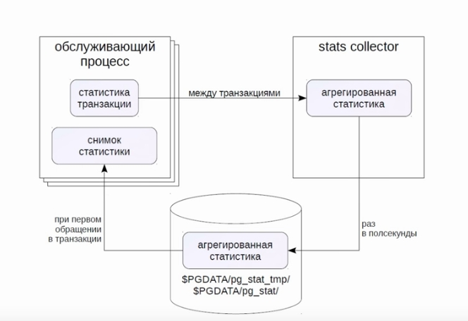

## Мониторинг

### Средства ОС

#### Процессы
`ps | grep postgres`

#### Использование ресурсов
`iostat, vmstat, sar, top`

### Статистика. Коллектор статистики

#### Текущие активности (активных и фоновых процессов)
Настройка: pg_stat_activity  
Параметр track_activities(включен по умолчанию) 


#### Сбор stats collector
* обращение к таблицам и индексам    **track_counts** (on)
* обращение к страницам              **track_io_timing** (off)
* вызовы пользовательских функций    **track_functions** (off)




#### Использование статистики  
Расширения из коробки:  
 * pg_stat_statements // по запросам
 * pgstattuple // по вресиям строк
 * pg_buffercache // состояние буферного кэша

### Журнал серверных сообщений

log_destination = 
 * stderr
 * csvlog
 * syslog
 * eventlog

#### Коллектор сообщений (`logging_collector = on`)
 * собирает дополнительную инфу
 * никогда не теряет сообщения (в отличии от `syslog`)
 * записывает stderr и csvlog в `log_directory / log_filename`

#### Настройки
* сообщения опред. уровня         `log_min_messages`
* время выполн. длинных комманд     `log_min_duration_statement`
* имя приложения                    `application_name`
* конточки                          `log_checkpoints`
* подключения / отключения          `log_(dis)connections`
* текст выполняемых комманд         `log_statement`


#### Ротация

* маска имени файла              `log_filename`
* время ротации, мин             `log_rotation_age`
* размер файла                   `log_rotation_size`
* перезапись                     `log_truncate_on_rotation = on`

```
 'postgresql-%H.log', '1h' 24 файла в сутки
 'postgresql-%a.log', '1d' 7 файлов в неделю
 ```

 #### Анализ журнала  
 grep, awk, pgBadger


#### Сбор статистики
```
select pg_stat_reset();
select pg_stat_reset_shared('bgwriter');
```

 ### Стресс тесты PostgreSQL  `pgbench`  :

Создание набора таблиц, наполнение данными для работы  

```
 pgbench -i admin_monit
 ```

Запуск нагрузочного тестирования
```
 pgbench -T 10 admin_monit
 ```
