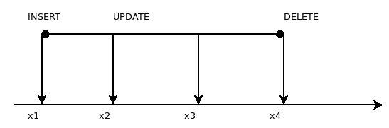

### Изоляции и многоверсионность MVCC

Есть таблица со строками и процессы использующие строки.  
Идея такая: при одновременном чтении и изменении строк требуются   
создавать очереди из-за блокировок.  
Но очереди - плохо, вернее медленно.  
для этого `PostgreSQL` использует `MVCC`, что позволяет хранить разные версии строчек **ОДНОВРЕМЕННО**  

`x1` - версия строки появилась  
`x2` - весрия строки удаляется, поялвяется новая  
`x4` - вресия строки удаляется  
`xid` - номер транзакции (flush по максимуму)  

#### Что делает транзакция при чтении строки:  
Транзакции работают с понятием `snapshot` - согласоннная картина данных на момент времени.  
`snapshot` - число. Выбираем список из транзакций незавершенных и актуальных, а остальное - удаляем.

MVCC  позволяет экономить на блокировках.

#### Блокировки строк
 * чтение не блокирует строк
 * изменение строки блокирует для изменений, но не для чтений

#### Блокировки таблица
 * запрещают изменение или удаление таблицы, пока с ней идёт работа 
 * запрещают чтение таблицы при перестроении или перемещении

#### Время жизни блокировок
 * устанавливаются по мере необходимости или вручную
 * снимаются автоматически при завершении транзакции

#### Статус транзакций (xact)
служебная инфа, два бита на транзакцию
 * 1й бит - коммит
 * 2й бит - роллбэк

Специальные файлы на диске
буферы в общей памяти

### Очистка (Vacuum)

 * Старые вресии строк хранятся с актуальными
 * со временем размер таблииц и индекс увеличивается.  

#### Vacuum:
 * удаляет версии строк которые уже не нужны
 * работает параллельно с остальными процессами
 * удаляя старые версии, образует "ДЫРЫ", в которые пишутся новые вресии строк

#### Vacuum FULL
*  **полностью** перестараивает файл данных, делая их компактнее
* блочит таблицу на Время работы

#### Auto Vacuum  
*AutoVacuum  launcher*:
 * фоновый процесс  
 * реагирует на активность изменения данных  

*AutoVacuum Worker*:
 запускается по необходимости и выполняет очистку

### Уровни Изоляции:

`Read uncommited` - не поддерживается PostgreSQL, можно читать незафиксированные данные.
  
`Read commited` - снимок строится на момент начала оператора
одинаковые запросы могут каждый раз получать разыне данные
  
`Repeatable read` - снимок строит на момент начала первого оператора транзакции
транзакция может завершиться с ошибкой сериализации
  
`Serializable` - полная изоляция (как будто 1 транзакция на БД)

