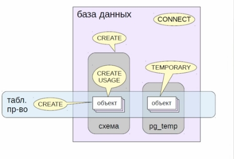

## Привелегии


### Виды привелегий

Таблицы:
```
 * SELECT        //чтение
 * INSERT        // вставка строк
 * UPDATE        // изменение строк
 * REFERENCES    // внешний ключ
 * DELETE        // удаление строк
 * TRUNCATE      // очистка Таблицы
 * TRIGGER       // создание триггеров
```
 Представления - SELECT и TRIGGER

 Последовательности
```
 SELECT     currval
 UPDATE              nextval     setval
 USAGE      currval  nextval   
 ```


#### Функции

```
EXECUTE
    SECURITY INVOKER - вызвавшего (по умолчанию)
    SECURITY DEFINER - создавшего
```

#### Катеогории ролей

* Суперпользователи - полный доступ ко всем объектам
* Владельцы - доступ в рамках выданных привелегий 
* Остальные роли

### Выдача привелегий
* роль1: GRANT (ALL) привелегии ON объект TO роль2;
* роль1: REVOKE (ALL)  привелегии ON объект TO роль2;

### Передача привелегий
* роль1: GRANT привелегии  ON объект TO роль2 WITH GRANT OPTION;
#### Отзыв привелегии
* роль1: REVOKE привелегии ON объект TO роль2 CASCADE;
#### Отзыв права передачи
* роль1: REVOKE GRANT OPTION FOR привелегии ON объект TO роль2 CASCADE;


Псевдороль `public`:
БД:
* CONNECT
* TEMPORARY
СХЕМА:
* CREATE
* USAGE
Функции:
* EXECUTE

Дополнительные привелегии по умолчанию:  
```
ALTER DEFAULT PRIVILEGES 
       [IN SCHEMA схема]
       GRANT  привелегии ON класс_объектов TO роль;


ALTER DEFAULT PRIVILEGES 
       [IN SCHEMA схема]
       REVOKE  привелегии ON класс_объектов FROM роль;
```
