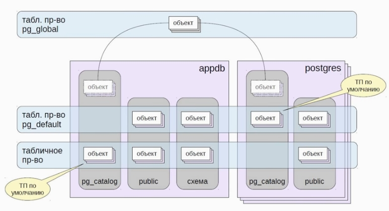

## Табличные пространства   
Это то,  как данные хранятся на дисках



### Табличные пространства по  умолчанию
 * Создаются по умолчанию
 * все объекты созданные будут принадлежать им
 * `pg_default` -- каталог `base`
 *  `pg_global` -- каталог `global`


 ### DEMO
 
 #### Вывод Табличных пространств:
 ```
 SELECT * FROM pg_tablespace;
 \db
 ```

#### Создание пользовательского:
```
CREATE TABLESPACE ts LOCATION '/home/posgtres/td_dir';
```

#### При создании БД указываем табличное пространство по умолчанию
```
CREATE DATABASE appdb TABLESPACE ts;
```

#### Можно изменять ТП
```
ALTER TABLE 1 SET TABLESPACE ts;
```

#### Можно изменять ТП
```
SELECT pg_size_pretty( (pg_tablespace_size('ts')) );
```
