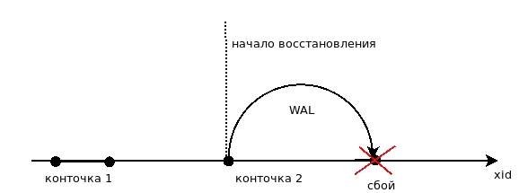

## Буферный кэш и журнал

### Буферный кэш
 * страница данных 8Кб - доступно при сборке
 * доп инфо
 * большая часть памяти

 Процесс ищет данные сперва в буферном кэше
 если нет, просим ОС прочитать страницу в буферный кэш
 если в кэшэ ОС нету, то происходит обращение к диску.

 #### Вытеснение редко используемых страниц
 если страница былиза изменнеи она становится "dirty",  
 и через некоторое время через кэш ОС она попадает на диск.

 #### Проблемы:
 мы не читаем и не запсываем данные сразу на диск (а делаем это в RAM),
 мы момжем **потерять** данные из-за сбоя (отключения электричества).

### Журнал предвариательной записи (WAL)

#### Журнал - непрерывный поток байт.
поток инфы о выполняемых действиях
позволяющей повторно выполнить потерянные при сбое операции  
Запись имеет номер LSN (log sequence number - 64bit)

Мы формируем запись о том, что мы хотим сделать
Запись попадает на диск ранее, чем измененные данные  
Почему это эффективнее? Писать страницу на диск - писать в произвольное место.  
А журнал - поток на запись, за счет этого есть выигрыш по времени

Что попадает в WAL:
 * всё что попадает в буферный кэш - страницы таблиц, индексов, объектов, xact

### Запись на диск

#### Синхронный режим
При `COMMIT;` вызывается `fsync` что физически доносит данные до диска, но при этом страдает производительность.

* запись при фиксации
* обслуживающий процесс

#### Асинхронный режим
Физически данные доходят до диска только при запуске процесса `walwriter`, при этом страдает durability.

 * фоновая запись
 * walwriter
 * регулируется synchronous_commit
 Смысл всего этого такой - `либо быстро, либо надёжно`.

#### Текущая позиция в журнале (два 32bit числа через '/' ):  
select pg_current_wal_lsn();

#### Просмотр файлов журнала: 
 * `PGDATA/pg_wal`
 * select * from pg_ls_waldir*() order by name;

#### Уровни журнала (wal level)
 * Minimal - гарантия восстановления после сбоя
 * Replica  - резервирование / репликация
 * Logical -  логиечская репликация: инфа о добавлении, изменении, удалении табличных строк

### Контрольная точка

Конточка - периодический пинудительный сброс всех "грязных" буферов на диск.  
гарантирует попадание на диск всех изменений до контрольной точки  
ограничивает размер журнала необходимого для восстановления.  
Процесс создания занимает 50+% времени между конточками для их создания (чтобы размазать процесс по времени и не иметь пиковых нагрузок на диск)  

Восстановление
 * начинается с последней конточки
 * последовательно проигрываются записи, если изменений нет на диске

### Запист журнала:

#### Конточка
сброс ВСЕХ грязных буферов на диск  
Процесс называется `checkpointer`.  

#### Фоновая запись 
Сброс ЧАСТИ грязных буферов на диск  
Процесс называется `bgwriter`.  

#### Обслуживающие  процессы
Сброс вытесняемого грязного буфера

************************************
