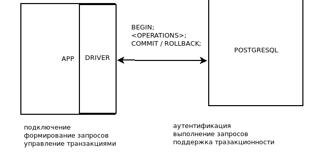
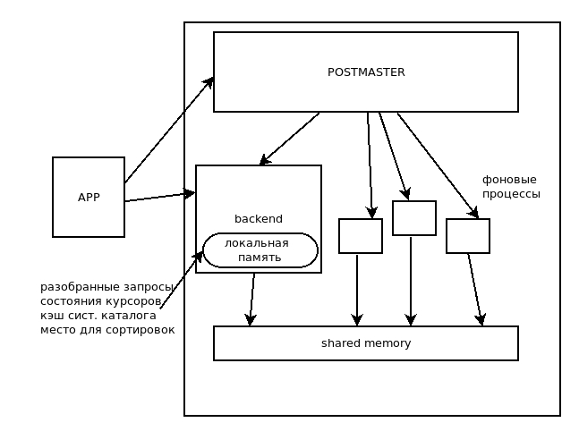
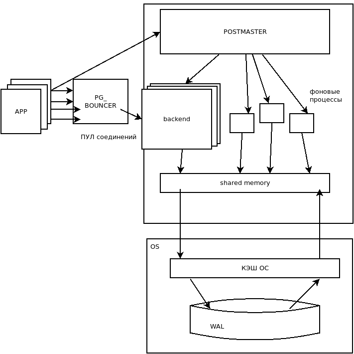

### Архитектура Postgresql

#### ACID

 * *Atomic* - атомарность, все или нгичего
 * *Concurrency* - согласованность, ограничения целостности
 * *Isolantion* - изоляция, влияние параллельных процессов
 * *Durability*- прочность, сохранность данных даже после сбоя

 #### Разбор запроса: 
 **Синтаксический** (какие слова) и **семантический** (какие объекты)   
 **Системный каталог** - описание таблиц, индексов и тп.  

 #### ЗАПРОС --> РЕЗУЛЬТАТ

 Разбор 		<- *системный каталог*  
 Трансформация  <- *правила*  
 Планирование   <- *статистика*  
 Выполнение 	<- *данные*

#### Подготовка операторов
* Для частых одинаковых запросов. *
ПОДГОТОВКА ->  формирование представления -> ПРИВЯЗКА параметров -> ЗАПРОС

#### Курсор

Когда не нужно получать весь запрос **полностью**, то есть работа с результатом **построчно**
Хранится в локальной памяти

### Процессы Postgresql  
Сам Postgresql представляет набор взаимодействующих процессов:  

Основной процесс `Postgres [postmaster]`
 * присматривает за фоновыми процессами
 * слушает входящие подключения
 * порождает `backend` - процесс для приложения (1 на 1 app)
 
 
  
Общая память - память для взаимодействия процессов
  * при взаимодействии множества `backend` запускаются `блокировки`
 
 
