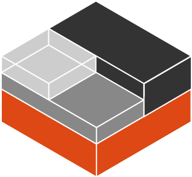

# LXD

Не сумев найти эту инфу я ~~проебал~~ потерял 8 часов жизни, реально втыкая и пытаясь понять ЧЯНДТ????!! Даж переводить не хочу... Просто таки ~~ротебал~~. Вернее обидно.  

>There are typically two ways to create a bridged network setup:
>
>host-shared bridge: create a bridge out of your main network interface which will hold both the host's IP and the container's IP addresses.
>
>independent bridge: create a different bridge out of thin air and link your containers together on this bridge, but use forwarding to get it out on the internet or to get traffic into it.
>
>The first type would have direct internet access or network access using a host-supplied or host-network (same subnet) IP address.
>
>This means that the first type can acquire a DHCP lease from the host network. The second type is sitting on its own internal network and is getting ?masqueraded. That means it is sitting behind a NAT firewall and is only getting ports forwarded to it.
>
>Lxc-net uses type 2. An lxc-net configuration is a masqueraded configuration.
>
>Both types of configuration normally use the veth network setup for the container.!!!
>

#### Сеть настроить лучше через:
```
lxd init (или перенастроить через dpkg-reconfigure)
или руками:
sudo vim /etc/default/lxd-bridge
```
